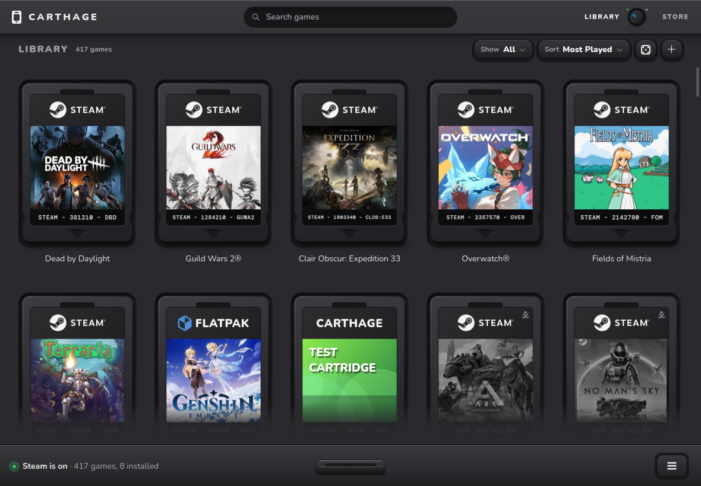
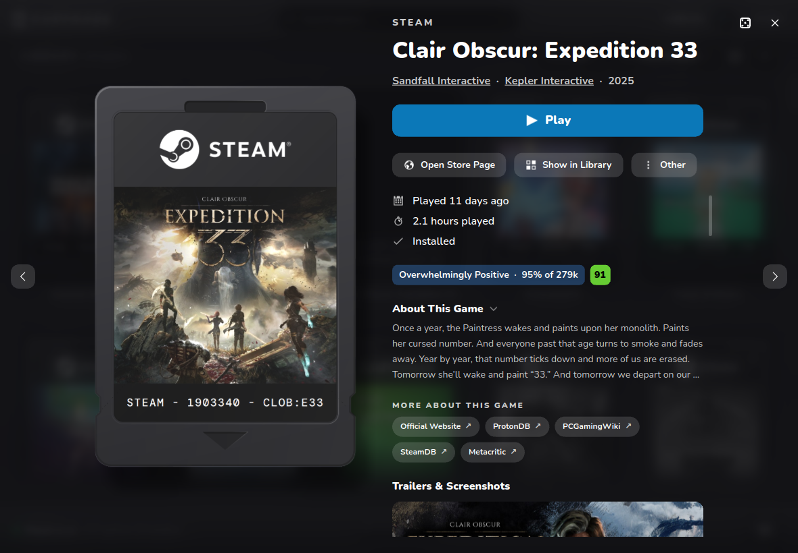
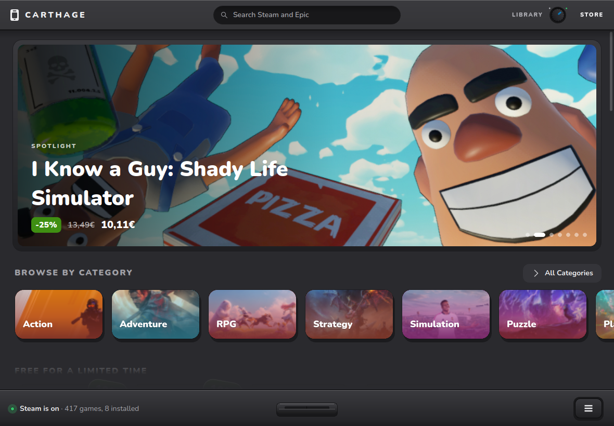

# Carthage



## Regarding AI usage
 Carthage was built with Claude Opus 5.5
 I'm learning to code, and wanting to make this project is what got me into it. 
 I gave Claude a try, and yes it basically wrote the whole thing, but it made me want
 to be able to code without it.
 I don't want my only approach to coding to be sending a prompt, so I'm studying, 
 and I'm determined to one day be able to build something like this myself. 
 I do not in any way claim to be a developer or to know what the different parts of this 
 code do, yet I am determined to get there. This is just a way to share the project
 I am using as a learning tool. Thank you for reading this, and I hope you have fun 
 using Carthage as much as I am enjoying learning how to make something like this.

## Carthage
Carthage is a game launcher for Linux and Windows. It gathers your games from Steam, Heroic,
Lutris, Flatpak, Epic, Battle.net, Riot and games you add yourself, and shows each one as a
cartridge. Start one and it slides into the dock while it runs. The Steam and Epic stores are
built in, in the same style as your library.





## Download

Get it from the [latest release](https://github.com/lopiksaa/carthage/releases/latest):

- **Windows:** the setup `.exe`
- **Linux:** run this in a terminal (running it again updates Carthage):

  ```sh
  curl -fsSL https://raw.githubusercontent.com/lopiksaa/carthage/main/install.sh | sh
  ```

  Or download the AppImage from the release.

Carthage updates itself. You can turn that off in Menu → System.

## Keys and privacy

Carthage works without any keys. It finds your installed games, draws a printed label for
cartridges without art, and shows the stores. Three free keys add more. You can add them
during setup or later in Menu → Accounts & Keys:

| Key | What it adds | Sent only to |
|---|---|---|
| SteamGridDB | Custom game art for your cartridges, fetched from SteamGridDB's website | www.steamgriddb.com |
| Steam Web API | Every Steam game you own, with your play time, not only the ones installed on this PC | api.steampowered.com |
| IsThereAnyDeal (experimental, not tested) | GOG, Microsoft Store, EA and Battle.net prices in the store | api.isthereanydeal.com |

Keys are kept in your system's password store: the Secret Service keyring (KDE Wallet or GNOME
Keyring) on Linux, and Credential Manager on Windows. They're never written to a file or a log.

Carthage has no accounts, analytics or telemetry. It only goes online to:

- load the Steam and Epic stores
- check GitHub for updates (you can turn this off)
- show Discord Rich Presence, if you turn that on (it's off by default)

## Run from source

Carthage is Python 3.13+ and Qt Quick (PySide6 6.11).

**Arch / CachyOS** (the only distro Carthage has been tested on so far):

```sh
sudo pacman -S pyside6 qt6-declarative qt6-multimedia qt6-svg python-numpy python-pillow \
    python-xlib python-gobject libsecret
python -m carthage
```

**Anywhere else:**

```sh
pip install "PySide6==6.11.*" numpy pillow
pip install python-xlib PyGObject   # Linux: window handling and the keyring
pip install psutil                  # Windows
python -m carthage
```

Useful while working on it:

- `python -m carthage --dev` reloads the interface when a QML file changes.
- Set `QT_FORCE_STDERR_LOGGING=1` to see QML errors.
- Set `GC_FAKE_COUNT=500` to fill the tray with 500 fake games.

`packaging/` builds the Windows installer and the Linux AppImage. The same steps run in
`.github/workflows/release.yml`.

## Credits

This project is inspired by [Cartridges](https://github.com/kra-mo/cartridges).

## License

Carthage is free software under the [GNU General Public License v3.0 or later](LICENSE).

**AI Usage Disclaimer:** Co-built with Anthropic's Claude.\
Carthage is co-designed and co-built using AI tools.

The license covers the code, not the name or the logo. You're welcome to make your own version
of Carthage, but please give it a different name and icon, so nobody mistakes it for this one.

Fonts, icons, textures, sounds and launcher logos come from other projects and keep their own
licenses. See [THIRD_PARTY_NOTICES.md](THIRD_PARTY_NOTICES.md).

## Trademarks

Carthage is an independent project. It isn't affiliated with, endorsed or sponsored by any of
these companies or projects:

- Valve (Steam)
- Epic Games (Epic Games Store)
- Blizzard Entertainment (Battle.net)
- Riot Games
- CD PROJEKT (GOG)
- Electronic Arts (EA app)
- Microsoft (Microsoft Store, Xbox)
- Discord
- SteamGridDB and IsThereAnyDeal
- Heroic Games Launcher, Lutris and Flatpak

Their names and logos belong to their owners. Carthage shows a launcher's name or logo only to
tell you where a game comes from.

Copyright © 2026 lopiksa
